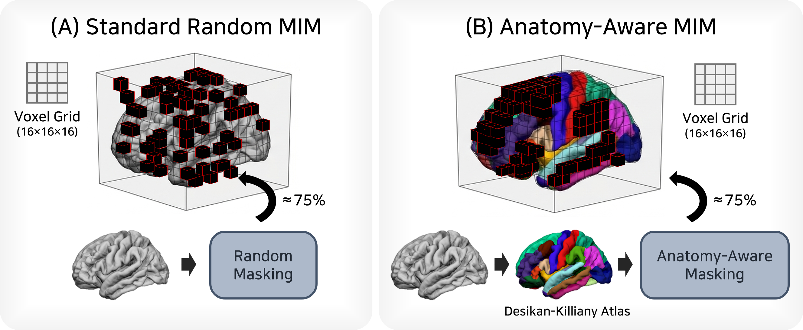

<div align="center">

# Anatomy-Aware MIM

**Anatomy-Aware Masked Image Modeling for Self-Supervised Learning on 3D Brain MRI**

&nbsp;
[](https://pytorch.org/)&nbsp;
[](https://www.python.org/)&nbsp;
[](LICENSE)


<br>
<em>(A) standard random MIM &nbsp;·&nbsp; (B) anatomy-aware MIM</em>

</div>

---

## Overview

Masked image modeling (MIM) pretrains a vision encoder by reconstructing randomly masked patches, but uniform random masking gives every patch — a sliver of cortex, a strip of white matter — the same chance of being hidden, regardless of anatomy. **Anatomy-aware MIM** masks by cortical parcellation instead: whole anatomical regions are masked together, so the encoder has to recover them from long-range inter-regional context rather than local interpolation.

This repository pretrains a 3D Swin Transformer encoder on T1-weighted brain MRI with seven pretext tasks trained jointly — masked-image reconstruction, rotation and patch-location prediction, contrastive learning, anatomy segmentation, and morphology/texture regression — then evaluates the frozen encoder with linear probing on a downstream classification task.

## Paper

> **Y. Kim** and W. H. Lee, "Anatomy-Aware Masked Image Modeling for Self-Supervised Learning on 3D Brain MRI," to appear in *Conference on Cognitive Computational Neuroscience (CCN)*, 2026.

## Method

| Strategy | Masking |
|:--------:|---------|
| **Random** | `MaskGenerator` — uniform random masking of 16³-voxel patches (≈75% budget); the standard MIM baseline, ignores anatomy |
| **Atlas** | `AtlasGuidedMaskGenerator` — every patch is assigned its dominant `aparc+aseg` label, and whole anatomical regions are masked until the same ≈75% budget is reached |

`DataAugmentation` in `main.py` selects between the two via `--mim-mask-mode {random,atlas}`.

Both conditions optimize the same seven pretext tasks jointly, with task loss weights learned automatically by uncertainty weighting (Kendall et al., CVPR 2018): image rotation prediction, patch-location prediction, a contrastive NT-Xent objective, anatomy segmentation, morphology regression, texture regression, and the masked-image reconstruction task itself.

## Repository layout

```
main.py            multi-task pre-training entry point; both mask generators
models.py          SSLHead_Swin — shared encoder + one head per pretext task
swin_unetr.py      3D Swin Transformer backbone (MONAI)
datasets.py        subject discovery and pretext-target loading
loss.py            NT-Xent contrastive loss + uncertainty weighting
ops.py             random 90° rotation augmentation (image and atlas co-rotated)
utils.py           distributed setup, schedulers, checkpointing, logging
linear_probe.py    frozen-encoder linear probing with k-fold cross-validation
extract/           one-off extraction of the tabular pretext targets
```

## Getting started

### Installation

```bash
conda create -n aamim python=3.10 -y
conda activate aamim
pip install -r requirements.txt
```

Install the [PyTorch](https://pytorch.org/get-started/locally/) build that matches your CUDA version first if the default wheel does not suit your setup.

### Data

Each subject is a directory holding a brain-extracted T1-weighted volume and its cortical parcellation, as produced by a FreeSurfer-style pipeline (e.g. FastSurfer):

```
<data-path>/
  <subject>/
    mri/brainmask.nii.gz            brain-extracted T1w
    mri/aparc+aseg.nii.gz           cortical parcellation
    mri/aparc+aseg.mgz              (input to extract/gmwmcsf.py)
    stats/lh.aparc.DKTatlas.mapped.stats
    stats/rh.aparc.DKTatlas.mapped.stats
  results/                          written by extract/ (see below)
```

Passing `--data <name>` restricts training to the subject directories listed in `data/<name>.txt` (or `<data-path>/<name>.txt`), one subject per line.

### Pre-computing pretext targets

The morphology and texture tasks regress per-subject descriptors that are too slow to derive on the fly, so they are extracted once into `<data-path>/results/`:

```bash
python extract/gmwmcsf.py --data-path /path/to/dataset
python extract/extract_all_features.py --data-path /path/to/dataset --workers 32
```

### Pre-training

The two conditions differ in exactly one flag:

```bash
# baseline: random masking
python -m torch.distributed.launch --nproc_per_node=4 main.py \
    --data-path /path/to/dataset \
    --mim-mask-mode random \
    --epochs 300 --batch_size_per_gpu 2 \
    --output_dir ./runs/random_mim --name random_mim

# ours: anatomy-aware masking
python -m torch.distributed.launch --nproc_per_node=4 main.py \
    --data-path /path/to/dataset \
    --mim-mask-mode atlas \
    --epochs 300 --batch_size_per_gpu 2 \
    --output_dir ./runs/atlas_mim --name atlas_mim
```

Optimisation follows AdamW with a base learning rate of `5e-4` scaled linearly by the effective batch size, cosine annealing, 5 warm-up epochs, and mixed precision. Checkpoints are written to `--output_dir` every `--saveckp_freq` epochs, and metrics are streamed to Weights & Biases (`--project`, `--name`; `--run-id` resumes an existing run).

Ready-made wrappers for both runs are in [`scripts/`](scripts).

### Linear probing

Freeze a checkpoint and evaluate it:

```bash
python linear_probe.py \
    --checkpoint ./runs/atlas_mim/checkpoint0100.pth \
    --data-path /path/to/eval_dataset \
    --gpu 0
```

The evaluation root needs a `participants.tsv` with a `group` column; subjects labelled `HC` or `SCZ` are kept, everything else is dropped. Metrics (balanced accuracy, AUC, F1, precision, recall) are pooled over the held-out folds and written to `--output-dir` as JSON.

## Related work

| | |
|---|---|
| **Upstream** | J. Kim, M. Kim, and H. Park, "Domain Aware Multi-Task Pre-Training of 3D Swin Transformer for Brain MRI," *ACCV 2024*, pp. 2124–2144. ([arXiv:2410.00410](https://arxiv.org/abs/2410.00410)) — this repository forks [DAMT](https://github.com/jongdory/DAMT). |

```bibtex
@InProceedings{Kim_2024_ACCV,
    author    = {Kim, Jonghun and Kim, Mansu and Park, Hyunjin},
    title     = {Domain Aware Multi-Task Pre-Training of 3D Swin Transformer for Brain MRI},
    booktitle = {Proceedings of the Asian Conference on Computer Vision (ACCV)},
    month     = {December},
    year      = {2024},
    pages     = {2124-2144}
}
```

## Acknowledgment

The Swin Transformer backbone comes from [MONAI](https://github.com/Project-MONAI/MONAI)'s SwinUNETR, and the distributed-training utilities from [DINO](https://github.com/facebookresearch/dino) (both already vendored in upstream DAMT). See [NOTICE](NOTICE) for details.

## License

Apache License 2.0 — see [LICENSE](LICENSE).

## Citation

The CCN 2026 proceedings are not published yet; the BibTeX entry will be added here once they are available.
